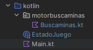

# BuscaminasComposeEnunciado
Reutilizando la capa de negocio la tarea anterior, tenemos que conseguir un busca minas con  interface Compose. 
Se pide:
- Reutilizar obligatoriamente la capa de negocio  de la tarea anterior que se asume que es independiente de la E/S. Esto incluirá la clase Buscaminas y otras clases y funciones si fuera el caso
- La capa de negocio estará en un paquete motorbuscaminas
- A su vez, el código compose debe estar organizado en dos ficheros para separar las descripciones de los componentes de la gestión del estado y la lógica de interacción con el usuario.
- La estructura de la aplicación debe contener al menos 3 ficheros (puede tener más si lo deseas). Recuerda el ejemplo de Piedra Papel y Tijera de los apuntes para tener en cuenta la organización del código 

- En Buscaminas.kt se encontrará la capa de negocio, es decir, la clase Buscaminas y todas las funciones y clases adicionales que pudiste tener que escribir para la gestión de la clase Buscaminas. Puedes organizar todo esto en ficheros adicionales dentro del paquete motorbuscaminas si así lo deseas.
- En EstadoJuego.kt la gestión del estado lo que incluirá la creación de un objeto Buscaminas y toda la lógica que permite a Compose recomponerse
- En Main.kt, está la descripción de los componentes.
  
